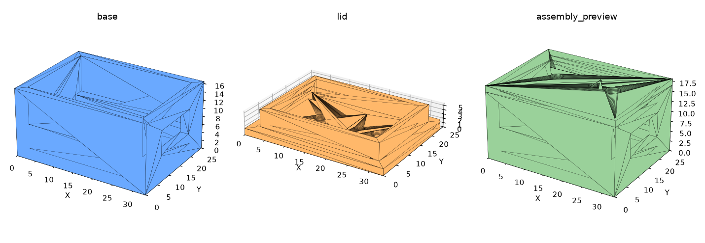

# Gehäuse (3D-Druck) – ESP32-C3 Super Mini + INMP441 + Akku

Parametrisches Gehäuse für die Meeting-KI-Hardware:
**ESP32-C3 Super Mini** (ohne Pinleiste) + **INMP441**-Mikrofon (ohne Pinleiste)
+ **LiPo-Akku 20 × 27 × 5 mm**.

Außenmaße: **33 × 25 × 18 mm** (Unterteil 16,5 mm + Deckel 1,5 mm).



## Dateien

| Datei | Zweck |
|-------|-------|
| `meeting_ki_case.FCMacro` | **Parametrisches FreeCAD-Macro** – hier alle Maße ändern |
| `generate_case.py` | Erzeugt die STLs ohne FreeCAD (trimesh) – gleiche Maße |
| `base.stl` | Unterteil (drucken wie es liegt, offene Seite nach oben) |
| `lid.stl` | Deckel (flache Oberseite liegt auf dem Druckbett, Rand nach oben) |
| `assembly_preview.stl` | nur zur Ansicht (Deckel aufgesetzt) |

## In FreeCAD öffnen/ändern

1. FreeCAD starten → Menü **Macro → Macros… → „meeting_ki_case.FCMacro"** →
   **Ausführen**. Es entstehen die Körper „Base" und „Lid", und die STLs werden
   neben das Macro exportiert.
2. Maße ändern: oben im Macro die `#define`-ähnlichen Variablen anpassen
   (z. B. `IN_L`, `IN_W`, `IN_H`, `BATT_H`, `USB_W/H/Z`, `WALL`) und erneut
   ausführen.

Alternativ ohne FreeCAD neue STLs erzeugen:
```bash
pip install trimesh manifold3d numpy
python generate_case.py
```

## Aufbau / Montage

```
  Deckel  ── Schallloch über dem Mikrofon, Löcher für Taster + LED
            └ INMP441 liegt in der Tasche an der Deckelunterseite
  ─────────────────────────────────
  ESP32-C3 Super Mini  ── liegt auf zwei Auflageschienen (lange Wände)
  ─────────────────────────────────
  LiPo-Akku 27×20×5    ── liegt unten auf dem Boden
  ─────────────────────────────────  Unterteil
```

- **USB-C** zeigt zur Schmalseite mit dem Ausschnitt (Laden/Flashen).
- Das **INMP441** kommt mit der Schallöffnung nach oben in die Deckeltasche; das
  3-mm-Loch im Deckel liegt darüber. Mit etwas Heißkleber/Doppelklebeband fixieren.
- Verkabelung mit dünnen Litzen (Projekt ist „ohne Pinleiste" ausgelegt).

## ⚠️ Bitte vor dem Druck prüfen (Maße variieren je nach Hersteller)

Ich habe mit typischen Maßen gerechnet – **miss deine echten Teile nach** und
passe sie im Macro an:

- **ESP32-C3 Super Mini**: Platine ~22,5 × 18 mm; **USB-C-Buchse** Lage/Höhe →
  bestimmt `USB_Z`, `USB_W`, `USB_H`. Die Buchse sitzt an der Schmalseite.
- **INMP441 ohne Pinleiste**: Platine ~15 × 13 mm → `MIC_L`, `MIC_W`; Lage der
  Schallöffnung → `MIC_OFFSET_X` (Loch soll genau darüber liegen).
- **Akku**: bestätige **27 × 20 × 5 mm** (L×B×H) inkl. Schutzschaltung; Kabel­abgang
  braucht evtl. etwas Platz.
- **Taster/LED**: `BTN_OFFSET_X`, `LED_OFFSET_X` an deine tatsächliche Bauteillage
  anpassen (oder Löcher weglassen).

## Hinweise zum Druck

- Material PLA/PETG, 0,2 mm Schicht, 3 Perimeter – kein Support nötig
  (Unterteil offen nach oben, Deckel flach).
- Der Deckel ist als **Reibschluss-Steckdeckel** ausgelegt (`RIM_CLEAR = 0,3 mm`).
  Sitzt er zu stramm/locker, `RIM_CLEAR` anpassen.
- **LiPo-Sicherheit:** Akku nicht quetschen/durchbohren; Gehäuse nicht luftdicht
  verkleben, etwas Luft lassen. Kein Dauer-Einschluss beim Laden ohne Aufsicht.
